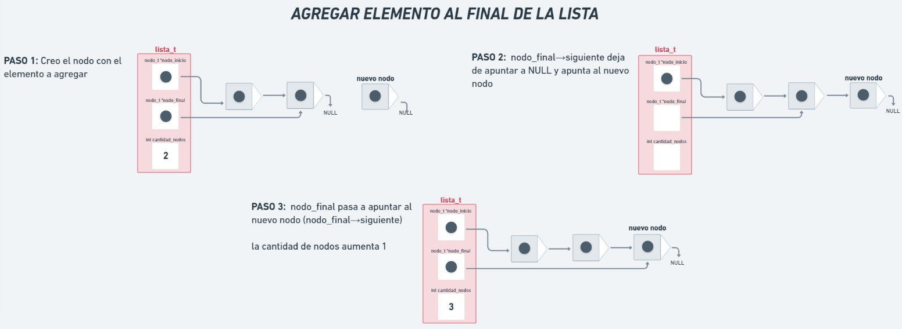
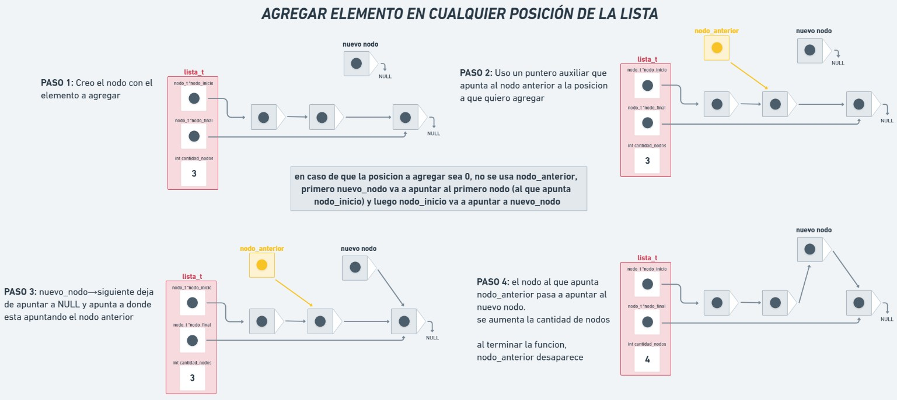
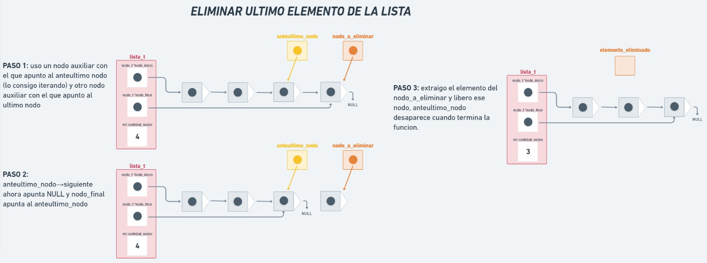
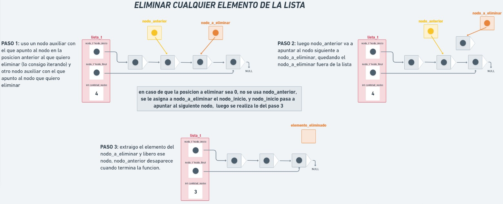
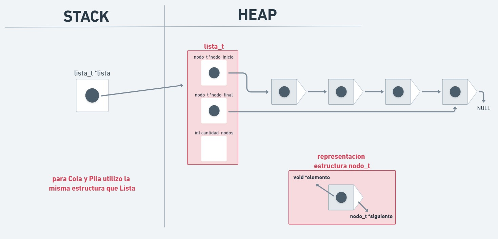

<div align="right">

</div>

# NOMBRE TP/TDA

## Repositorio de (Nombre Apellido) - (Padrón) - (Mail)

- Para compilar:

```bash
make pruebas_chanutron
```

- Para ejecutar:

```bash
./pruebas_chanutron
```

- Para ejecutar con valgrind:
```bash
make valgrind-chanutron
```
---
##  Funcionamiento

Explicación de cómo funcionan las estructuras desarrolladas en el TP y el funcionamiento general del mismo.

Aclarar en esta parte todas las decisiones que se tomaron al realizar el TP, cosas que no se aclaren en el enunciado, fragmentos de código que necesiten explicación extra, etc.

Incluír **EN TODOS LOS TPS** los diagramas relevantes al problema (mayormente diagramas de memoria para explicar las estructuras, pero se pueden utilizar otros diagramas si es necesario).

En este TP se desarrollo el funcionamiento de los TDAs Lista, Pila y Cola.
Se uso la implementacion de Lista para implementar Pila y Cola.
Basicamente se desarrollaron todas las acciones que pueden realizar estos tipos de datos, sumado a los iteradores externo e interno para la Lista.

se usaron las siguientes estructuras:

struct nodo {
	void *elemento;
	struct nodo *siguiente;
};

struct lista {
	struct nodo *nodo_inicio;
	struct nodo *nodo_final;
	size_t cantidad_nodos;
};

struct lista_iterador {
	struct nodo *nodo_actual;
	lista_t *lista;
};

Paso a explicar el funcionamiento:

la funcion `lista_crear` se encarga de reservar en memoria el espacio para una lista_h inicializada en cero. devuelve el puntero a la lista o NULL en caso de que falle.

`lista_vacia`es una funcion booleana que recibe un lista_t* y devuelve true en caso de que la lista sea nula o este vacia, o false en caso de que tenga elementos.

yo implemente una funcion `obtener_nodo_en_posicion`que recibe una lista y un size_t posicion y retorna el nodo que se encuentra en esa posicion de la lista.

`lista_insertar`inserta el elemento que recibe al final de la lista que recibe (siempre y cuando la lista no sea nula), crea el nodo donde se guarda el elemento (reservando memoria dinamica para el mismo) y lo inserta al final de la lista haciendo que el puntero del ultimo nodo apunte hacia este nuevo nodo.
si logra insertar correctamente, aumenta la cantidad de nodos en 1 y devuelve la lista con el nodo agregado. si la lista es nula o falla la asignacion de memoria para el nodo, devuelve NULL. la complejidad de esta funcion es O(1).

<div align="center">

</div>


`lista_insertar_en_posicion` es similar a la anterior en cuanto a reservar la memoria para el nuevo nodo y validar que la lista no sea nula y que la asignacion de memoria no falle, lo que cambia es que recibe un valor con la posicion en la que debe ser insertado el elemento. 
se recorre la lista hasta encontrar el nodo en la posicion anterior a la que se quiere agregar, luego el nuevo nodo va a apuntar al nodo que le sigue al nodo anterior, y el nodo anterior va a apuntar al nuevo nodo, quedando insertado el nuevo nodo en la posicion correcta. la complejidad de esto es O(n).
si la posicion es 0, el nuevo nodo va a apuntar al primer nodo de la lista, y lista->nodo_inicio va a apuntar al nuevo nodo, quedando el nuevo nodo en la posicion inicial. la complejidad en este caso es O(1).
si la posicion es mayor o igual a la cantidad de nodos, se inserta al final usando `lista_insertar` donde ya dijimos que la complejidad era O(1).
en cualquier caso se aumenta la cantidad de nodos.

<div align="center">

</div>


`lista_quitar` quita el ultimo elemento de una lista, siempre y cuando esta no sea nula y no este vacia.
si tiene un solo nodo, se devuelve el elemento de ese nodo, el nodo es liberado de la memoria y los nodos inicio y final quedan apuntando a NULL, la cantidad de nodos sera 0. este caso tiene complejidad O(1).
si tiene mas de un elemento, se recorre la lista hasta llegar al anteultimo nodo, se guarda en una variable auxiliar el nodo a eliminar (el ultimo), luego el anteultimo nodo apunta a NULL, dejando al que era el ultimo nodo afuera de la lista, nodo_final va a apuntar al anteultimo nodo. luego se toma el elemento del nodo a eliminar y se libera este nodo, la cantidad de nodos disminuye en 1. la complejidad es O(n).

<div align="center">

</div>


`lista_quitar_de_posicion` similar a la anterior, solo que se le indica la posicion donde se debe eliminar el nodo.
si la posicion es mayor a la cantidad de nodos, se usa `lista_quitar`.
si la posicion es 0, nodo_a_eliminar apunta a nodo_inicio, luego nodo_inicio apunta a nodo_inicio_siguiente, se extrae el elemento de nodo_a_eliminar y se libera este nodo. la complejidad es O(1) en este caso.
si la posicion es mayor a 0 y menor a la cantidad de nodos, lo que se hace es recorrer la lista para obtener el nodo anterior a la posicion indicada, luego a nodo_a_eliminar se le asigna el nodo siguiente a nodo_anterior y nodo_anterior deja de apuntar al nodo siguiente (que es el que se quiere eliminar) y apunta al siguiente de ese, asi el nodo en la posicion indicada queda desenlazado de la lista. se extrae el elemento del nodo y luego se lo libera. la complejidad es O(n).
en los tres casos se disminuye la cantidad de nodos.

<div align="center">

</div>


`lista_elemento_en_posicion` recibe una lista y un valor de posicion. devuelve un puntero al elemento que se encuentra en el nodo de la posicion indicada.
la complejidad es O(n) ya que se recorre la lista hasta llegar a la posicion buscada. si la lista es nula o la posicion es mayor a la cantidad de nodos de la lista, se devuelve NULL.

`lista_primero` y `lista_ultimo` funcionan de manera similar, primero chequean que la lista no esta vacia ni sea nula (se valida en lista_vacia), si pasa este chequeo, se devuelve un puntero al primer o ultimo elemento de la lista.
ambas son O(1).

`lista_tamanio` devuelve la cantidad de nodos que hay en la lista. si esta es nula o esta vacia, devuelve 0.

FUNCIONES DEL ITERADOR: estas funciones hacen lo necesario para poder usar un iterador externo en la lista. 
`lista_iterador_crear` reserva la memoria para la estructura lista_iterador_t.
el iterador va a apuntar al primer nodo de la lista (si no esta vacia), y tiene un puntero a la lista en si. si la lista es nula devuelve NULL.
`lista_iterador_tiene_siguiente` chequea si el nodo al que apunta el iterador es valido, para asi poder avanzar al siguiente en caso de que se lo requiera.
`lista_iterador_avanzar` si el nodo siguiente al que apunta el iterador es valido, el iterador avanza y apunta hacia el nodo siguiente y devuelve true. si el nodo siguiente es null, el iterador apunta a NULL y se devuelve false. en caso de que el iterador sea nulo o apunta a nulo, devuelve false.
`lista_iterador_elemento_actual` devuelve un puntero al elemento del nodo al que esta apuntando el iterador, si el iterador o el nodo al que apunta son NULL, devuelve NULL.
`lista_iterador_destruir`libera la memoria del iterador.

`lista_buscar_elemento`recibe la lista y una funcion para comparar elementos, junto con el contexto con el cual se compara, basicamente lo que hace es recorrer los nodos y aplicarles esta funcion a los elementos, devuelve el elemento encontrado o NULL si no se encuentra.
se encarga de verificar que la lista sea valida, que no este vacia y que la funcion no sea nula.

`lista_destruir`se encarga de liberar la memoria usada por la lista, libera la memoria de todos los nodos y la de la lista.

`lista_destruir_todo` itera la lista y le aplica una funcion a los elementos para destruirlos, luego usa `lista_destruir`para liberar la memoria de la lista.

`lista_con_cada_elemento` es un iterador interno que usa la funcion que recibe para comparar los elementos de los nodos con el contexto que recibe, esta funcion recibida devuelve true si se sigue iterando o false para que se deje de iterar. la funcion devuelve los nodos que se recorrieron.

---

## Respuestas a las preguntas teóricas

### EXPLICACION DE LISTA, PILA y COLA
Tanto la lista, como la pila y la cola, son TDAs que sirven para agrupar elementos. son similares en algunos aspectos pero diferentes en otros.
La lista agrupa los elementos desde un elemento que es el inicial, hasta el elemento final, todos los elementos tienen un elemento anterior (salvo el inicial) y un sucesor (salvo el final), en la lista se puede acceder a todos los elementos de la misma, se pueden quitar, agregar y obtener elementos en cualquier posicion de la lista.
En pila y cola no se puede acceder a todos los elementos de ellas.
La cola se caracteriza por utilizar la politica FIFO (el primero que entra, es el primero que sale). Solo se puede acceder al primer elemento de la cola, y se puede agregar solo al inicio y eliminar el primer elemento (si quisiera eliminar el ultimo elemento, primero se deben eliminar todos los anteriores)
La pila, usa la politica LIFO (ultimo que entra, primer que sale), al contrario que en la cola, solo se puede acceder al ultimo elemento, se puede insertar solo al final y eliminar el ultimo (mismo caso, si quiero obtener el primer elemento que se agrego, primero debo quitar todo los elementos posteriores). En mi implementacion uso el nodo_inicial como tope.

para los 3 tdas en este programa se uso la misma estructura lista_t, donde para pila y cola solo se usaron las funciones necesarias para que cumplan con las caracteristicas antes mencionadas (agregar, quitar y obtener en el ultimo elemento para la pila y en el primero para la cola)

### DIAGRAMA DE MEMORIA USADO PARA LISTA, PILA y COLA:
<div align="center">

</div>


### COMPLEJIDAD LISTA SIMPLEMENTE ENLAZADA
  - como al primer nodo se puede acceder directamente, tanto insertar, como obtener y eliminar al inicio son O(1)
  - como en mi implementacion use una referencia al nodo final, puedo acceder directamente a ese nodo, entonces insertar y obtener al final son O(1), eliminar al final en cambio es O(n) ya que debe recorrer todos los nodos de la lista hasta obtener el anteultimo nodo.
  - tanto insertar, como obtener y eliminar al medio son O(n) ya que deberia recorrer los nodos anteriores de la lista hasta llegar al nodo en la posicion requerida (obtener) o al nodo anterior (insertar y eliminar)

### COMPLEJIDAD LISTA DOBLEMENTE ENLAZADA
 - las operaciones al inicio y final tienen la misma complejidad que la simplemente enlazada, la que se modifica es la de eliminar al final, en esta implementacion esta operacion es O(1) ya que desde el nodo final puedo acceder directamente al anteultimo nodo y asi eliminar el nodo final.
 - tanto insertar, como obtener y eliminar en el medio siguen siendo O(n), ya que por mas que arranquemos a recorrer en el inicio o el final, deberiamos recorrer una cantidad de nodos del vector, en el peor de los casos podriamos llegar a recorrer todo el vector.

### COMPLEJIDAD LISTA CON VECTOR DINAMICO
  - tanto para insertar como para eliminar al inicio se debe recorrer el vector para reacomodar los elementos, por lo tanto son O(n). obtener al inicio es O(1)
  - para insertar al final pueden ocurrir dos cosas, que el vector tenga lugar para insertar,ahi seria O(1), o que se haya llenado el vector y se deba agrandar usando realloc, aca seria O(n). obtener y eliminar al final son O(1) si se tiene una referencia al ultimo elemento. 
  - insertar, obtener y eliminar en el medio son O(n)


### COMPLEJIDAD DE LAS FUNCIONES DE PILA y COLA

`pila_apilar`tiene complejidad O(1), ya que agrega un elemento al inicio(tope), y el nodo_inicio ya lo tenemos referenciado
`pila_desapilar`tiene complejidad O(1), ya que uso el nodo_inicial como tope (el tope seria el ultimo nodo y apunta al nodo anterior), entonces para eliminar el tope, se guarda en un puntero auxiliar y el nodo_inicial(tope) apunta al siguiente nodo (nodo anterior si se ve como Pila).
`pila_tope`y `pila_tamanio`son O(1)

`cola_encolar` es O(1), al insertar un elemento al final de la cola, el nodo_final ya lo tenemos referenciado.
`cola_desencolar` es O(1), elimina el primer nodo de la cola, que ya lo tenemos referenciado.
`cola_frente`y `cola_tamanio`son O(1)
